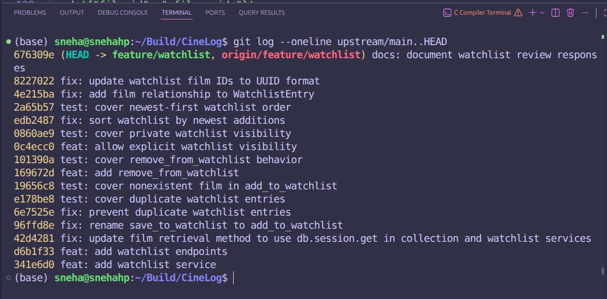

# PR Response Doc: CineLog Watchlist Feature

## AI Usage

I used Hermes during this project to help me inspect the codebase, make code changes, run tests, and clean up my Git history.

I first used it to understand how add_to_collection() handled missing films and duplicate entries. I then used that pattern when working on the watchlist service. I also used it to find every reference to save_to_watchlist() before renaming it.

Hermes helped me implement and test the deduplication logic, removal function, visibility option, newest-first sorting, and UUID updates after the rebase. I reviewed the code changes and used the test results to confirm the behavior.

I also used Hermes to check my conventional commit messages and help organize my responses for the visibility and sort order decisions. I made the final design choices and verified the documentation against the actual code, commits, and test results.

## Comment 1: Rename

**What I did:**

I renamed `save_to_watchlist()` to `add_to_watchlist()`. The function definition lives in `services/watchlist_service.py`, and I updated both the import and the call site in `routes/watchlist/watchlist.py`.

**Existing pattern followed:**

The project already has `add_to_collection()` in `services/collection_service.py`. That name follows verb-to-noun. I matched it.

**How I verified:**

After the change I ran `grep -R "save_to_watchlist"` across the whole repo. It came back empty in all Python files. Then I checked `grep -R "add_to_watchlist"` and confirmed the definition in `watchlist_service.py`, the import in `watchlist.py`, and the call site in `watchlist.py` were all present. I ran `pytest tests/ -v` and all 4 tests passed.

## Comment 2: Deduplication

**What I did:**

I added a new exception class, `AlreadyInWatchlistError`, at the top of `services/watchlist_service.py`. Inside `add_to_watchlist()`, after the film-exists check, I added a query for an existing `WatchlistEntry` matching both `user_id` and `film_id`. If a row is found, the function raises `AlreadyInWatchlistError` with a message identifying the film. If no match is found, it proceeds to create the entry, commit, and return it.

**Existing pattern followed:**

`add_to_collection()` in `services/collection_service.py` handles this the same way: it checks for a `CollectionEntry` with the same `user_id` and `film_id` and raises `AlreadyInCollectionError` on a match. I followed that exact sequence and gave the watchlist its own exception class to match how the collection service is structured.

**How I verified:**

I added `test_add_to_watchlist_duplicate_raises` in `tests/test_watchlist.py`. It adds a film to a user's watchlist once, then calls `add_to_watchlist()` again with the same user and film ID. The test expects `AlreadyInWatchlistError` on the second call and also confirms there is only one `WatchlistEntry` row in the database. I ran `pytest tests/ -v` and all 6 tests passed.

## Comment 3: Missing Test

**What I did:**

I added `test_add_to_watchlist_nonexistent_film_raises` to `tests/test_watchlist.py`. It calls `add_to_watchlist()` with a UUID string that was not inserted by any test fixture. The test asserts that `FilmNotFoundError` is raised.

**Existing test used as the model:**

`test_add_to_collection_nonexistent_film_raises` in `tests/test_collection.py`. Both tests use the `app` and `sample_user` fixtures, open an app context, call their respective service function with a nonexistent film ID, and assert `pytest.raises(FilmNotFoundError)`.

**How I verified:**

I ran `pytest tests/test_watchlist.py -v` and both watchlist tests passed. I then ran `pytest tests/ -v` and all 6 tests passed.

## Comment 4: Default Visibility

**My position:**

I would keep `public=True` as the default.

**Reasoning:**

CineLog is a community film tracking app. A big part of the value is seeing what other people are watching and want to watch. Public watchlists let users discover films through each other and make profiles and shared activity actually useful. If visibility defaults to private, every user who wants the social experience has to take an extra step before anyone else can see their list. Most users signing up for a community tracker probably expect to participate in that community. Public by default reduces friction for the common case.

**Tradeoff acknowledged:**

I understand the argument for private by default. Some people use a watchlist as a personal planning tool, not a social signal, and defaulting to public might surprise them. That tradeoff is real. The new `public` parameter gives callers explicit control over this. A caller who wants private entries can pass `public=False`, and the behavior will match exactly. But for a platform where community discovery is part of the point, I think public is still the better default.

## Comment 5: Sort Order

**My position:**

I would sort by `date_added` descending, newest first.

**Reasoning:**

A watchlist works like an active queue. Users come back to it to see what they recently saved and decide what to watch next. Newest-first makes it easy to confirm that a film just added actually landed, and it surfaces current interests at the top. That matches how people actually use a watchlist day to day.

**Engagement with the reviewer's point:**

I agree with the maintainer that most users want to see recent additions. That is exactly the case newest-first solves. Alphabetical sorting is more useful when you already know the title you want and are scanning for it, but that is a lookup task, not a browsing task. For normal watchlist use, alphabetical order just means your most recent pick might be buried anywhere in the list. Newest-first is better for the common case. If users also need to look up a specific title, search or filtering would be the right long-term solution for that, not making the default sort serve a less frequent need.

## Comment 6: Rebase

**What conflicted:**

I rebased `feature/watchlist` onto `upstream/main`, which contained the commit "refactor: migrate film IDs from integer to UUID". The only conflict was in `models.py`. The main branch did not define `WatchlistEntry` at all, so Git could not automatically place my `fix: add film relationship to WatchlistEntry` commit on top of the updated file. The conflict marker showed that main had no `WatchlistEntry` class and our branch was adding one with `film_id` typed as `db.Integer`.

**How I resolved it:**

I kept the full `WatchlistEntry` class from the feature branch and changed `film_id` from `db.Column(db.Integer, ...)` to `db.Column(db.String(36), ...)` to match the UUID type that main had applied to `Film.id` and `CollectionEntry.film_id`. After clearing the conflict markers, I ran `git add models.py` and `git rebase --continue`.

After the rebase finished I updated two more things to remove remaining integer assumptions. In `tests/test_watchlist.py`, `test_add_to_watchlist_nonexistent_film_raises` was using `fake_film_id = 99999`. I changed it to `fake_film_id = "00000000-0000-0000-0000-000000000000"`, a UUID string that was not inserted by any test fixture. In `services/watchlist_service.py`, the docstrings for `add_to_watchlist` and `remove_from_watchlist` still documented `film_id` as an integer. I updated both to `str`.

**How I verified no conflict remains:**

I ran `pytest tests/ -v` and all 10 tests passed. I ran `git log --merges --oneline upstream/main..HEAD` and it returned nothing, confirming no merge commits were introduced. I also confirmed `WatchlistEntry.film_id` is `db.String(36)` and the nonexistent film test uses a UUID string.

## Stretch Feature: Remove From Watchlist

**Implementation:**

I added `remove_from_watchlist(user_id, film_id)` to `services/watchlist_service.py`. I also added `NotInWatchlistError` to the same file. The function queries `WatchlistEntry` with `filter_by(user_id=user_id, film_id=film_id)`. If no row is found, it raises `NotInWatchlistError` with a message identifying the film ID. If the entry exists, it calls `db.session.delete(entry)`, commits the transaction, and returns `True`.

**Missing-entry behavior:**

If the film is not on the watchlist, the function raises `NotInWatchlistError`. This follows the same pattern as `remove_from_collection()` in `services/collection_service.py`, which raises `NotInCollectionError` on the same condition.

**Test coverage:**

I added two tests to `tests/test_watchlist.py`.

`test_remove_from_watchlist_removes_entry` adds a film, calls `remove_from_watchlist()`, asserts the return value is `True`, then confirms the `WatchlistEntry` count for that user and film is 0.

`test_remove_from_watchlist_missing_entry_raises` calls `remove_from_watchlist()` without adding the film first and asserts `NotInWatchlistError` is raised.

I ran `pytest tests/ -v` and all 10 tests passed.

## Stretch Feature: Second Test

**Edge case:**

`test_add_to_watchlist_duplicate_raises` in `tests/test_watchlist.py`. It adds the same film to the same user's watchlist twice. The second call is expected to raise `AlreadyInWatchlistError`. The test also queries the database directly and confirms only one `WatchlistEntry` row exists for that user and film.

**Why I chose it:**

Duplicate insertion is a realistic user action. A user might tap "save" twice, or a client might retry a failed request. Without the deduplication check, both calls would succeed silently and create two identical rows. That corrupts the data in a way that is hard to detect later. I chose this case because it tests both the error path and the database state, not just the exception.

## Stretch Feature: Visibility Toggle

**Parameter behavior:**

I added a `public` parameter to `add_to_watchlist(user_id, film_id, public=True)` in `services/watchlist_service.py`. The value is passed directly into the `WatchlistEntry` constructor, so whatever the caller provides is what gets stored. There is no logic that converts `False` back to `True`.

**Default:**

The default is `True`. Callers that do not pass `public` get a public entry, which matches the existing model default and the CineLog community use case.

**Caller usage:**

The POST route in `routes/watchlist/watchlist.py` reads `public = data.get("public", True)` from the request body, then passes it to `add_to_watchlist()`. A caller who wants a private entry sends `{"film_id": "<uuid>", "public": false}` in the request body.

**Test coverage:**

`test_add_to_watchlist_allows_private_entry` in `tests/test_watchlist.py` calls `add_to_watchlist()` with `public=False`. It asserts the returned entry has `public` set to `False`, then queries the database and confirms the stored row also has `public` set to `False`.

I ran `pytest tests/ -v` and all 10 tests passed.

## Commit History Screenshot



```
git log --oneline upstream/main..HEAD
```

## PR Description

### Summary

This PR adds the watchlist feature to CineLog. Users can:

- Add a film to their watchlist with `POST /watchlist/<user_id>/add`.
- Prevent duplicate entries. Adding the same film twice raises `AlreadyInWatchlistError`.
- Remove a film from their watchlist using `remove_from_watchlist()` in the service layer.
- Set visibility when adding. Pass `"public": false` in the request body for a private entry. Defaults to public.
- Retrieve their watchlist with `GET /watchlist/<user_id>`. Results are sorted newest first.

### Design Decisions

**Default visibility: public.**
CineLog is community focused. Public by default lets users participate in discovery without extra steps, while callers can still pass `public=false` for private entries.

**Sort order: newest additions first.**
Watchlists act like active queues. Users commonly return to check what they added recently, so newest-first surfaces the most relevant entries at the top.

### Manual Testing

```bash
# 1. Set up
python3 -m venv .venv
source .venv/bin/activate
pip install -r requirements.txt

# 2. Start the app
flask run
```

Use a valid user UUID from your database for `<user_id>` and a valid film UUID for `<film_id>` in the commands below.

```bash
# 3. Add a film (public, default)
curl -s -X POST http://localhost:5000/watchlist/<user_id>/add \
  -H "Content-Type: application/json" \
  -d '{"film_id": "<film_uuid>"}'

# 4. Retrieve the watchlist (newest first)
curl -s http://localhost:5000/watchlist/<user_id>

# 5. Add the same film again -- expect AlreadyInWatchlistError (400 or 409 depending on error handler)
curl -s -X POST http://localhost:5000/watchlist/<user_id>/add \
  -H "Content-Type: application/json" \
  -d '{"film_id": "<film_uuid>"}'

# 6. Add a private entry
curl -s -X POST http://localhost:5000/watchlist/<user_id>/add \
  -H "Content-Type: application/json" \
  -d '{"film_id": "<another_film_uuid>", "public": false}'

# 7. Confirm the entry is private in the watchlist response
curl -s http://localhost:5000/watchlist/<user_id>

# 8. Remove a film (service layer -- no HTTP endpoint yet)
#    Call remove_from_watchlist(user_id, film_id) directly in a Python shell or test.

# 9. Attempt to remove a film not on the watchlist
#    Expect NotInWatchlistError from remove_from_watchlist().

# 10. Submit a nonexistent film UUID
curl -s -X POST http://localhost:5000/watchlist/<user_id>/add \
  -H "Content-Type: application/json" \
  -d '{"film_id": "00000000-0000-0000-0000-000000000000"}'
# Expect FilmNotFoundError behavior.

# 11. Add multiple films with different timestamps, then GET to confirm newest appears first.

# 12. Run the full test suite
pytest tests/ -v
# Expected: 10 passed
```
